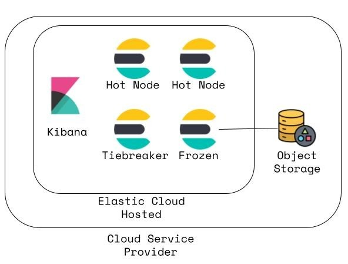

# Elastic Searchable Snapshot Migration Demo
## Contents
1.  [Summary](#summary)
2.  [Architecture](#architecture)
3.  [Features](#features)
4.  [Prerequisites](#prerequisites)

## Summary 
This demonstrates a couple options for migrating old/infrequently accessed non-timeseries data to searchable snapshots.

## Architecture 
  

## Features 
- Demonstrates two methods for migrating hot/non-timeseries data to a frozen layer
    - reindex
    - clone
- Depicts the REST API calls necessary for each method

## Prerequisites 
- Access to an Elasticsearch environment, specifically Kibana Dev Tools