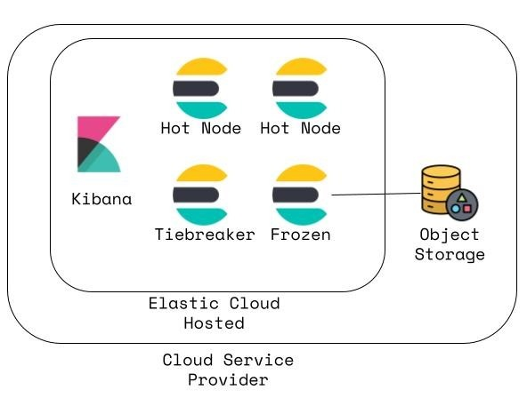

This article demonstrates two approaches for migrating infrequently accessed data in Elasticsearch to a less expensive medium via data tiering.  This sort of migration can be handled out-of-the-box for timeseries-oriented data via [Index Lifecycle Management](https://www.elastic.co/docs/manage-data/lifecycle/index-lifecycle-management) (ILM).  ILM supports both age and size triggers for migrating indices to cheaper storage.  For a search use case, those triggers are generally insufficient for making a migration decision.  Instead, more sophisticated logic is necessary.  This can be accomplished via the Elastic API.  In the end state, infrequently-accessed/never-updated data is put in the frozen tier as a [searchable snapshot](https://www.elastic.co/docs/deploy-manage/tools/snapshot-and-restore/searchable-snapshots).  Those snapshots reside in cloud object storage, making for a very affordable and resilient medium for searchable data.  

# Demo Scenario
This demo assumes an [Elastic Cloud Hosted](https://www.elastic.co/cloud) (ECH) architecture with [hot](https://www.elastic.co/docs/manage-data/lifecycle/data-tiers#hot-tier) and [frozen](https://www.elastic.co/docs/manage-data/lifecycle/data-tiers#frozen-tier) [data tiers](https://www.elastic.co/docs/manage-data/lifecycle/data-tiers).  The dataset consists of 1000 documents of article content indexed on one primary and one replica shard.  The articles are dated between March and September 2022.  We will be migrating the Mar-Aug articles off the hot tier to the frozen tier.  Those articles in the frozen tier will be stored as a searchable snapshot.

# Architecture
 

## Node Info
As depicted below, we have 2 nodes in the hot tier and 1 in the frozen tier.
```bash
GET _cat/nodes?v&h=name,node.role&s=name
```
```text
name                  node.role
instance-0000000000   himrst
instance-0000000001   himrst
instance-0000000002   f
tiebreaker-0000000003 mv
```

## Shard Info
```bash
GET _cat/shards/articles?v&s=index&h=index,node
```
```text
index    node
articles instance-0000000001
articles instance-0000000000
```
## Data 
### Sample Document
```json
{
 "link": "https://www.huffpost.com/entry/covid-boosters-uptake-us_n_632d719ee4b087fae6feaac9",
 "headline": "Over 4 Million Americans Roll Up Sleeves For Omicron-Targeted COVID Boosters", 
 "category": "U.S. NEWS", 
 "short_description": "Health experts said it is too early to predict whether demand would match up with the 171 million doses of the new boosters the U.S. ordered for the fall.", 
 "authors": "Carla K. Johnson, AP", 
 "date": "2022-09-23"
}
```
### Index Settings
```bash
GET articles/_settings
```
```json
{
  "articles": {
    "settings": {
      "index": {
        "routing": {
          "allocation": {
            "include": {
              "_tier_preference": "data_content"
            }
          }
        },
        "number_of_shards": "1",
        "provided_name": "articles",
        "creation_date": "1753906867856",
        "number_of_replicas": "1",
        "uuid": "RXbLdFrBTwy5Y8gfaRSbNA",
        "version": {
          "created": "9009000"
        }
      }
    }
  }
}
```
### Total Document Count
```bash
GET /articles/_count
```
```json
{
  "count": 1000,
  "_shards": {
    "total": 1,
    "successful": 1,
    "skipped": 0,
    "failed": 0
  }
}
```
### Target Document Count
Below is the count of documents (Mar-Aug) that we will be migrating off the hot tier to a searchable snapshot on frozen.
```bash
GET /articles/_count
{
  "query": {
    "range": {
      "date": {
        "gte": "2022-03-01",
        "lte": "2022-08-31"
      }
    }   
  }
}
```
```json
{
  "count": 873,
  "_shards": {
    "total": 1,
    "successful": 1,
    "skipped": 0,
    "failed": 0
  }
}
```
# Migration Options
I show two migration options below:  Clone and Re-index.  
## Clone Option
- faster but requires the source index be set to read-only before cloning
- can't change mappings, etc on the target index
## Re-index Option
- slower but doesn't require read-only
- can change mappings, apply scripts, etc to the target index


# Migration Option 1 - Clone 
Below is a step-by-step explanation of how to accomplish this migration using the (_clone)[https://www.elastic.co/docs/api/doc/elasticsearch/operation/operation-indices-clone] API.
## Step 1 - Set Source Index to Read-only
```bash
PUT /articles/_settings
{
  "settings": {
    "index.blocks.write": true
  }
}
```
## Step 2 - Clone the Source Index to a Target Index
```bash
POST /articles/_clone/03-2022_08-2022
```
## Step 3 - Re-enable Write access to both Source and Target
```bash
PUT /articles/_settings
{
  "settings": {
    "index.blocks.write": false
  }
}

PUT /03-2022_08-2022/_settings
{
  "settings": {
    "index.blocks.write": false
  }
}
```
## Step 4 - Delete Docs from Clone that will be retained in the Hot index
```bash
POST /03-2022_08-2022/_delete_by_query
{
  "query": {
    "range": {
      "date": {
        "gte": "2022-09-01"
      }
    }
  }
}
```
```json
{
  "took": 32,
  "timed_out": false,
  "total": 127,
  "deleted": 127,
  "batches": 1,
  "version_conflicts": 0,
  "noops": 0,
  "retries": {
    "bulk": 0,
    "search": 0
  },
  "throttled_millis": 0,
  "requests_per_second": -1,
  "throttled_until_millis": 0,
  "failures": []
}
```
## Step 5 - Create Searchable Snapshot
Create the snapshot via the [_snapshot](https://www.elastic.co/docs/api/doc/elasticsearch/group/endpoint-snapshot) API.
```bash
POST _snapshot/found-snapshots/archive_03-2022_08-2022?wait_for_completion=true
{
    "indices": "03-2022_08-2022",
    "ignore_unavailable": true,
    "include_global_state": false
}
```
```json
{
  "snapshot": {
    "snapshot": "archive_03-2022_08-2022",
    "uuid": "v78Jtu9HQ3aozbu87XaaEg",
    "repository": "found-snapshots",
    "version_id": 9009000,
    "version": "9.0.0-9.0.4",
    "indices": [
      "03-2022_08-2022"
    ],
    "data_streams": [],
    "include_global_state": false,
    "state": "SUCCESS",
    "start_time": "2025-07-30T20:50:57.788Z",
    "start_time_in_millis": 1753908657788,
    "end_time": "2025-07-30T20:50:58.589Z",
    "end_time_in_millis": 1753908658589,
    "duration_in_millis": 801,
    "failures": [],
    "shards": {
      "total": 1,
      "failed": 0,
      "successful": 1
    },
    "feature_states": []
  }
}
```
## Step 6 - Mount the Searchable Snapshot to Frozen Tier
```bash
POST _snapshot/found-snapshots/archive_03-2022_08-2022/_mount?wait_for_completion=true&storage=shared_cache
{
    "index": "03-2022_08-2022",
    "renamed_index": "idx-archive_03-2022_08-2022",
    "index_settings": {
        "index.number_of_replicas": 0,
        "index.routing.allocation.include._tier_preference": "data_frozen"
    },
    "ignore_index_settings": ["index.refresh_interval"]
}
```
```json
{
  "snapshot": {
    "snapshot": "archive_03-2022_08-2022",
    "indices": [
      "idx-archive_03-2022_08-2022"
    ],
    "shards": {
      "total": 1,
      "failed": 0,
      "successful": 1
    }
  }
}
```
## Step 7 - Delete the Migrated Docs from the Hot Index
Leverage the [_delete_by_query](https://www.elastic.co/docs/api/doc/elasticsearch/operation/operation-delete-by-query) API to clean out the migrated docs from the source index.
```bash
POST /articles/_delete_by_query
{
  "query": {
    "range": {
      "date": {
        "gte": "2022-03-01",
        "lte": "2022-08-31"
      }
    }
  }
}
```
```json
{
  "took": 32,
  "timed_out": false,
  "total": 873,
  "deleted": 873,
  "batches": 1,
  "version_conflicts": 0,
  "noops": 0,
  "retries": {
    "bulk": 0,
    "search": 0
  },
  "throttled_millis": 0,
  "requests_per_second": -1,
  "throttled_until_millis": 0,
  "failures": []
}
```
## Step 8 - Delete Clone
```bash
DELETE 03-2022_08-2022
```
## Results
The Mar-Aug documents are now in a searchable snapshot on the frozen tier.  The hot tier only has the 'latest' docs (Sep).
```bash
GET _cat/shards/idx-archive_03-2022_08-2022?v
```
```text
index                       shard prirep state   docs store dataset ip          node
idx-archive_03-2022_08-2022 0     p      STARTED  873    0b 564.4kb 10.42.12.59 instance-0000000002
```
```bash
GET /idx-archive_03-2022_08-2022/_settings
```
```json
{
  "idx-archive_03-2022_08-2022": {
    "settings": {
      "index": {
        "allocation": {
          "existing_shards_allocator": "searchable_snapshot_allocator"
        },
        "auto_expand_replicas": "false",
        "blocks": {
          "write": "true"
        },
        "provided_name": "03-2022_08-2022",
        "creation_date": "1753908202204",
        "recovery": {
          "type": "snapshot_prewarm"
        },
        "store": {
          "type": "snapshot",
          "snapshot": {
            "snapshot_name": "archive_03-2022_08-2022",
            "index_uuid": "D2WIN6KeSL--8z8ubwqGNA",
            "repository_uuid": "wgz5vXlvS5WXhsr5xWu1BA",
            "index_name": "03-2022_08-2022",
            "partial": "true",
            "repository_name": "found-snapshots",
            "snapshot_uuid": "v78Jtu9HQ3aozbu87XaaEg"
          }
        },
        "number_of_replicas": "0",
        "uuid": "_DmxxkcBSXKvicOleCQASQ",
        "version": {
          "created": "9009000"
        },
        "shard_limit": {
          "group": "frozen"
        },
        "routing": {
          "allocation": {
            "include": {
              "_tier_preference": "data_frozen"
            },
            "disk": {
              "watermark": {
                "ignore": "true"
              }
            }
          }
        },
        "number_of_shards": "1",
        "routing_partition_size": "1",
        "shard": {
          "check_on_startup": "false"
        }
      }
    }
  }
}
```
```bash
GET articles/_count
```
```json
{
  "count": 127,
  "_shards": {
    "total": 1,
    "successful": 1,
    "skipped": 0,
    "failed": 0
  }
}
```
```bash 
GET idx-archive_03-2022_08-2022/_count
```
```json
{
  "count": 873,
  "_shards": {
    "total": 1,
    "successful": 1,
    "skipped": 0,
    "failed": 0
  }
}
```

# Migration Option 2 - Re-index
Below is the same migration performed with the _reindex API.  Many of the same steps from the clone migration are repeated here.
## Step 1 - Create a Filter Script
(Painless script)[https://www.elastic.co/docs/explore-analyze/scripting/modules-scripting-painless] below to allow for filtering which documents wind up in the index that is ultimately converted to a searchable snapshot. 
```bash
POST _scripts/date_filter
{
  "script": {
    "lang": "painless",
    "source": """
      LocalDate doc_date = LocalDate.parse(ctx._source.date);
      LocalDate filter_start = LocalDate.parse(params['filter_start']);
      LocalDate filter_end = LocalDate.parse(params['filter_end']);
      if (doc_date.isBefore(filter_start) || doc_date.isAfter(filter_end)) {
        ctx.op = 'noop';
      }
    """
  }
}
```
## Step 2 - Re-index to a Temp Index
Here we're moving the docs that are targeted for migration to a searchable snapshot to a temporary index via the (_reindex)[https://www.elastic.co/docs/api/doc/elasticsearch/operation/operation-reindex] API and the filter script above.
```bash
POST _reindex 
{
  "source": {
    "index":"articles"
  },
  "dest": {
    "index": "03-2022_08-2022"
  },
  "script": {
    "id": "date_filter",
    "params": {
      "filter_start": "2022-03-01",
      "filter_end": "2022-08-31"
    }
  }{
  "took": 282,
  "timed_out": false,
  "total": 1000,
  "updated": 0,
  "created": 873,
  "deleted": 0,
  "batches": 1,6
  "version_conflicts": 0,
  "noops": 127,
  "retries": {
    "bulk": 0,
    "search": 0
  },
  "throttled_millis": 0,
  "requests_per_second": -1,
  "throttled_until_millis": 0,
  "failures": []
}
}
```
```json
{
  "took": 282,
  "timed_out": false,
  "total": 1000,
  "updated": 0,
  "created": 873,
  "deleted": 0,
  "batches": 1,
  "version_conflicts": 0,
  "noops": 127,
  "retries": {
    "bulk": 0,
    "search": 0
  },
  "throttled_millis": 0,
  "requests_per_second": -1,
  "throttled_until_millis": 0,
  "failures": []
}
```
## Step 3 - Create Searchable Snapshot
Same as Step 5 in the Clone Migration

## Step 4 - Mount the Searchable Snapshot to Frozen Tier
Same as Step 6 in the Clone Migration

## Step 5 - Delete the Migrated Docs from the Hot Index
Same as Step 7 in the Clone Migration

## Step 6 - Delete Temp Index
Same as Step 8 in the Clone Migration

# Source
https://github.com/joeywhelan/search-snapshot